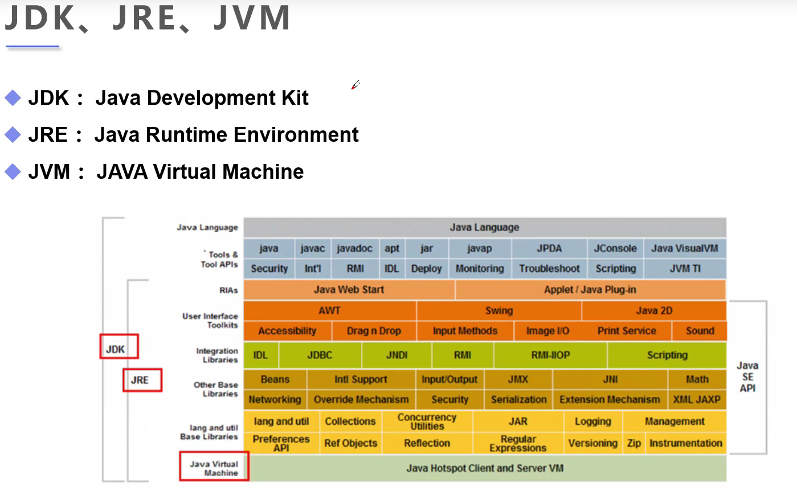

[toc]

## Java 入门01 - 程序语言的历史发展

1. **流行语言的诞生**

| 语言 | 诞生时间 | 特点                                                         |
| ---- | -------- | ------------------------------------------------------------ |
| C    | 1972     | - 贴近硬件、运行极快、效率极其高<br />- 操作系统、编译器、数据库、网络系统等<br />- 指针和内存管理 |
| C++  | 1982     | - 面向对象<br />- 兼容C<br />- 图形领域、游戏等              |
| Java | 1995     | - 语法像C<br />- 没有指针<br />- 没有内存管理<br />- 可移植<br />- 面向对象<br />- 类型安全<br />- ... |


2. **Java 的发展简述**

   1. 95年的网页简单粗糙，缺乏互动性 ----> Java 为了推广，于是先推出了图形界面小程序Applet，具备浏览器运行环境。
   2. J2SE ----> 桌面市场（标准版本：桌面程序...）
   3. J3ME ----> 手机市场（嵌入式开发：手机，小家电...）
      1. J2EE ----> 服务器市场（E企业级开发：web，服务器开发 ）
   4. ....大量巨头加入
   5. 基于Java开发了巨多的平台 + 系统 + 工具：
      1. 构建工具：Ant, Maven, Jekins
      2. 应用服务器：Tomcat, Jetty, Jboss, Websphere, Weblogic
      3. Web开发： Struts, Spring, Hibernate, MyBatis
      4. 开发工具： Eclipse, Netbean, Intellij idea, Jbuilder
      5. ...
   6. 2006 : Hodoop (大数据领域)
   7. 2008：Android

   

## Java 入门02 - Java的特性和优势

**1. Java特性和优势**

- 简单性
- 面向对象
- 可移植性
- 高性能
- 分布式
- 动态性
- 多线程
- 安全性
- 健壮性


## Java 入门03 - JDK\JRE\JVM




## Java 入门04 - HelloWorld

```java
//Hello.java
public class Hello{
    public static void main(String[] args){
        System.out.println("Hello World!");
    }
}
```

> - 类名须和文件名一致
> - Java 中，字符串须用双引号`""`

> ```bash
> # cmd
> $ cd Hello.java 所在目录；
> $ javac Hello.java
> $ java Hello
> ```


## Java 入门05 - Java 程序运行机制

**1. 编译型 和 解释型**

- 编译型：全部编译完成再执行；
- 解释型：一边编译一边执行；

**2. Java 程序运行机制**

```mermaid
graph LR
	A[.Java源程序] -.Java编译器.-> B[.class字节码]
	B --> 类装载器 --> 字节码校验器 -.解释器 .-> 机器码 --> 操作系统平台
```

> 编译型和解释型只是代码执行的两种方式，Java 既是编译型语言，也是解释行语言；
>
> - 编译：`file.java` --> `file.class`
> - 解释：`file.class` --> `机器码`

