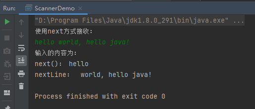

[toc]


## 1. 用户交互 Scanner

 Java 给我们提供了一个这样的工具类，可以用于获取用户的输入—— `java.util.Scanner` 

**基本语法：**

```java
Scanner S = new Scanner(System.in);
```

通过Scanner类的 `next()` 与 `nextLine()` 方法获取输入的字符串，在读取之前，我们一般需要使用 `hasNext()`与 `hasNextLine()`判断是否还有输入的数据。

- `next()`:
  1. 一定要读到有效字符后才可以结束输入。
  2. 对输入有效字符之前遇到的空白，next()方法会自动将其去掉。
  3. 只有输入有效字符后才将其后面输入的空白作为分隔符或者结束符。
  4. <span style="color:red">**next() 不能得到带有空格的字符串。**</span>
- `nextLine()`:  
  1. 以Enter为结束符号，也就是说nextLine()方法返回的是输入回车之前的所有字符。
  2. 可以获得空白。

```java
package com.jayce.scanner;

import java.util.Scanner;

public class ScannerDemo {
    public static void main(String[] args) {
        //创建一个扫描器对象，用于接收键盘数据
        Scanner scanner = new Scanner(System.in);
        System.out.println("使用next方式接收： ");

        //判断用户有没有输入字符串
        if(scanner.hasNext() == true){
            String str = scanner.next();
            String str2 = scanner.nextLine();
            System.out.println("输入的内容为： ");
            System.out.println("next()： "+str);
            System.out.println("nextLine： "+str2);
        }
        
        scanner.close()//凡是属于IO流的类如果不关闭就会一直占用资源 
    }
}
```




## 2. 顺序结构

- Java的基本结构就是顺序结构，除非特别指明，否则就按照顺序一句一句执行。
- 顺序结构是最简单的算法结构
- 语句与语句之间，框与框之间是按从上到下的顺序进行的，它是由若干个依次执行的处理步骤组成的，它是任何一个算法都不能离开的一种基本算法结构。 

## 3. 选择结构

- if单选择结构
- if双选择结构
- if多选择结构
- 嵌套的if结构
- switch 多选择结构 

```java
//if 多选择基本结构
if(condition1){
    //
}else if(condition2){
    //
}else if(condition3){
    //
}else{
    //
}
```


```java
//switch 多选择基本结构
switch(expression){
    case value:
        //
        break;
    case value:
        //
        break;
    default:
        //
}
```


```java
// switch 示例
char grade = 'C';
switch (grade){
    case 'A':
        System.out.println("优秀")；
        break;
	...
	case 'A':
    	System.out.println("优秀")；
		break;
    default:
        System.out.println("没有这个级别")；
}
```


## 4. 循环结构

- while 循 环
- do...while 循环
- for 循环
- 增强for循环

```java
// while 循环
package com.jayce;

public class LoopTypes {
    public static void main(String[] args) {
        int k = 3;
        int a = 0;
        while(a < k){
            System.out.println("a 小于 k");
            a++;
        }
    }
}
//a 小于 k
//a 小于 k
//a 小于 k

```

```java
// do...while 
package com.jayce;

public class LoopTypes {
    public static void main(String[] args) {
        int a = 1;
        do{
            System.out.println("先打印一次再说！:"+a);
            a++;
        }
        while(a < 5);
    }
}
//先打印一次再说！:1
//先打印一次再说！:2
//先打印一次再说！:3
//先打印一次再说！:4
```

```java
// for loop example1
package com.jayce.forloop;

public class ForLoop {
    public static void main(String[] args) {
        for (int i = 0; i < 5; i++) {
            System.out.println(i);
        }
    }
}
//0
//1
//2
//3
//4

//for loop example2
package com.jayce.forloop;

public class ForLoop {
    public static void main(String[] args) {

        for (int i = 1; i <= 9; i++) {
            for (int j = 1; j <= i; j++) {
                System.out.print(j + "*" + i + "=" + (i*j) + "\t");
            }
            System.out.println();
        }
    }
}


// output
1*1=1	
1*2=2	2*2=4	
1*3=3	2*3=6	3*3=9	
1*4=4	2*4=8	3*4=12	4*4=16	
1*5=5	2*5=10	3*5=15	4*5=20	5*5=25	
1*6=6	2*6=12	3*6=18	4*6=24	5*6=30	6*6=36	
1*7=7	2*7=14	3*7=21	4*7=28	5*7=35	6*7=42	7*7=49	
1*8=8	2*8=16	3*8=24	4*8=32	5*8=40	6*8=48	7*8=56	8*8=64	
1*9=9	2*9=18	3*9=27	4*9=36	5*9=45	6*9=54	7*9=63	8*9=72	9*9=81	
```

**增强for循环**

在Java5中，引入了一种主要用于数组或者集合的增强型for循环

```java
// 增强for循环语法格式
for(声明语句：表达式){
    //
}
```


```java
// 增强for循环的示例
 
public class enhanceForLoop {
    public static void main(String[] args) {
        int[] numbers = {10,20,30,40,50};//定义数组
        //增强for循环的写法取遍历
        for(int x:numbers){
            System.out.println(x);
        }

        System.out.println("==================");
        //普通for循环的遍历
        for (int i = 0; i < numbers.length;i++){
            System.out.println(numbers[i]);
        }
    }
}

// output
10
20
30
40
50
==================
10
20
30
40
50
```


## 5. break & continue

- `break` 在任何循环语句的主体部分，均可以使用`break` 控制循环的流程。 break 用于<span style="color:red">**强行退出循环**</span>，不执行循环中剩余的语句。（break语句在switch语句中使用）  
- `continue` 语句用在循环语句体中，用于终止某次循环过程，即跳过循环体中尚未执行的语句，接着进行下一次是否执行循环的判定。 

```java
// break

public class breakTeamp {
    public static void main(String[] args) {
        int i = 0;
        while (i<100){
            i++;
            System.out.println(i);
            if(i == 5){
                break;
            }
        }
        System.out.println("退出了循环");
    }
}

//output
1
2
3
4
5
退出了循环
```

```java
// continue
public class ContinueTemp {
    public static void main(String[] args) {
        int i = 0;
        while(i < 6){
            i++;
            if(i == 4){
                continue;
            }
            System.out.println(i);
        }
    }
}

//output
1
2
3
5
6
```

```java
// continue 和 label 的联合使用

public class continueWithLabel {
    public static void main(String[] args) {
        //打印101 ~ 150 之间所有的质数
        //质数是指在大于1的自然数中，除了1和它本身意外不再有其他因数的自然数
        int count = 0;
        outer: for (int i=101;i<150;i++){
            for (int j = 2; j < i/2; j++){
                if(i % j == 0){
                    continue outer;
                }
            }
            System.out.println(i + " ");
        }
    }
}

//output
101
103
107
109
113
127
131
137
139
149 
```

