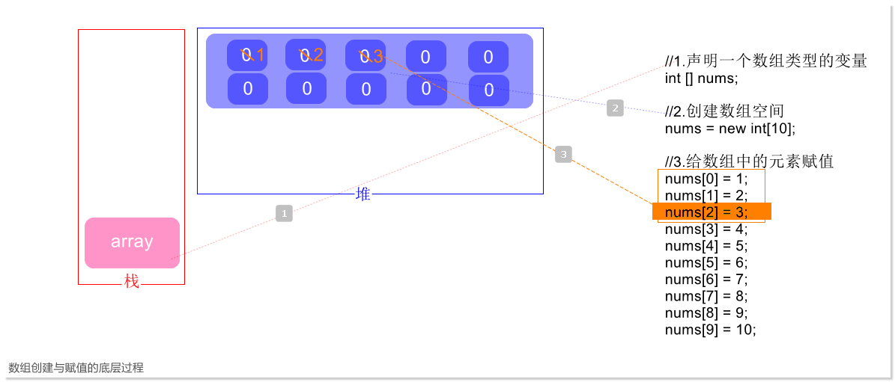
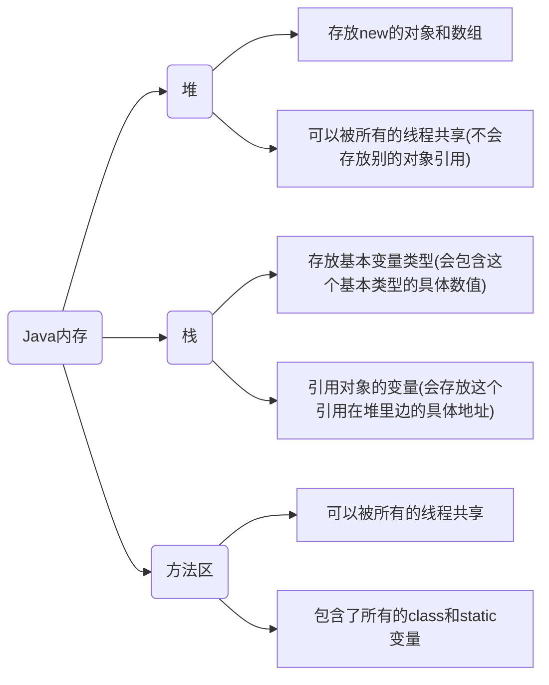

[toc]

## 1. 数组概述

- 数组是相同类型数据的有序集合
- 数组描述的是相同类型的若干个数据，按照一定的先后次序排列组合而成。
- 其中，每一个数据称作一个数组元素，每个数组元素可以通过一个下标来访问他们。


## 2. 数组声明创建

- 首先必须声明数组变量，才能在程序中使用数组。 下面是声明数组变量的语法：

  

  ### 创建

  **首选的方法：**

  ```java
  dataType[] arrayRefVar;
  ```

  **效果相同，但是非首选方法：**

  ```java
  dataType arrayRefVar[];//该方式是为了延续C语言开发者的使用习惯     
  ```

- Java语言使用 `new` 操作符来创建数组，语法如下：

  ```java
  dataType[] arrayRefVar = new dataType[arraySize];
  ```

- 数组是通过索引来访问的，数据的索引从0开始。

- 获取一个数组长度：`arrays.length`

```java
//示例
package com.jayce.demo;

public class ArrayExgs {
    public static void main(String[] args) {
        int [] nums; //声明一个数组类型的变量
        nums = new int[10];//这意味着该数组可以存放十个int类型的变量
		
        //简写
        // int[] nums = new int[10];
        
        //给数组中的元素赋值
        nums[0] = 1;
        nums[1] = 2;
        nums[2] = 3;
        nums[3] = 4;
        nums[4] = 5;
        nums[5] = 6;
        nums[6] = 7;
        nums[7] = 8;
//        nums[8] = 9;
        nums[9] = 10;

        System.out.println(nums[8]);
    }
}
//output
0
```

> :warning: 注意：如果数组中的元素没有被赋值，那么默认的会以0填充。






### **数组的初始化：**

Java中，数组的初始化有三种：

- 静态初始化

  ```java
  int[] a = {1,2,3};
  ```

  > 注意，一经创建，大小就不能再改变了
  >
  > ```java
  > int [] nums = {1,2,3};
  > nums[3] = 4;
  > System.out.println(nums[3]);
  > //output
  > Exception in thread "main" java.lang.ArrayIndexOutOfBoundsException: 3
  > 	at com.jayce.demo.ArrayExgs.main(ArrayExgs.java:6)
  > ```

- 动态初始化

  ```java
  int[] a = new int[2];
  a[0] = 1;
  a[1] = 2;
  ```

- 数组的默认初始化

  - 数组是引用类型，它的元素相当于类的实例变量，因此数组一经分配空间，其中的每个元素也被按照示例变量同样的方式被隐式初始化。

### **数组的注意事项（数组的四个基本特点）**

- 其长度是确定的，数组一旦被创建，他得大小就是不可以改变的。

- <span style="color:red">其元素必须是相同类型，不允许出现混合类型</span>（这点不同于JavaScript）。

  ```java
  int [] nums; //那么nums 中的元素类型只能是int
  ```

- 数组中的元素类型可以是任何数据类型，包括基本类型和引用类型。 

  ```java
  int [] nums; //可以是int类型的数组
  double [] dnums;//可以是double类型的数组
  char [] chars;//可以是char类型的数组
  ...
  ```

- 数组变量属于引用类型，数组也可以看成对象，数组中的每个元素相当于该对象的成员变量。数组本身就是对象。

  Java中对象是在堆中的，因此数组无论保存原始类型还是其他对象类型。数组对象本身实是在堆中的。


### **数组的边界问题：**

- 数组下标（索引）的合法区间：[0, length-1], 如果越界就会报错：

  ```java
  public static void main(String[] args){
      int [] a = new int[2];
      System.out.println(a[2]);
  }
  // output exception
  ArrayIndexOutOfBoundsException //数组下标越界
  ```


### **小结：**

- 数组是相同数据类型（数组类型可以是任意类型）的有序集合
- 数组也是对象。数组元素相当于对象的成员变量
- 数组长度是确定的，不可改变的。 如果越界，就会报超出边界错误："ArrayIndexOutOfBounds"


## 3.数组使用

- For-Each 循环
- 数组作方法入参
- 数组作返回值

 ```java
 public class ArrayReverse {
     public static void main(String[] args) {
         int[] arr = {1,2,3,4,5};
         int[] reverseArr = reverse(arr);
         printarr(arr);
         printarr(reverseArr);
     }
     //数组应用： 使用for循环反转数组项
     public static int[] reverse(int[] arrays){
         int [] result = new int[arrays.length];//创建一个新数组
         for(int i = 0,j=result.length-1;i<arrays.length;i++,j--){
             result[j] = arrays[i];
         }
         return result;
     }
     public static void printarr(int[] arrays){
         for (int i = 0; i < arrays.length; i++) {
             System.out.print(arrays[i] + " ");
         }
         System.out.println();
     }
 }
 
 //output
 1 2 3 4 5 
 5 4 3 2 1 
 ```


## 4.多维数组

- 多维数组可以看成是由数组组成的数组，比如，二维数组就是一个特殊的一维数组，其每一个元素都是一个二维数组。

  ```java
  // 一个两行五列的数组
  int a[][] = new int[2][5]
  ```

  

## 5.Arrays 类


## 6.稀疏数组


