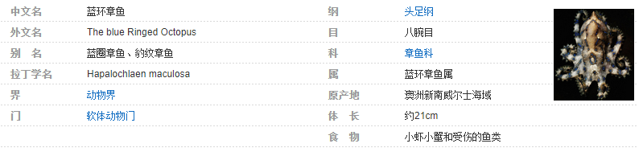

[toc]

## 继承

1. 继承的本质是对某一批类的抽象，从而实现对现实世界更好的建模。 

2. `extands` 的意思是 “扩展”。 子类是父类的扩展。 

3. <span style="color:red">Java 中的类只有单继承，没有多继承！</span>

4. 继承是类和类之间的一种关系。 除此之外，类和类之间的关系还有 依赖、组合、聚合 等。 

5. 继承关系的两个类， 一个为子类（也叫派生类）， 另一个叫做父类（也叫基类）。 子类继承父类，使用关键字 `extends` 来表示。

6. 子类和父类之间，从意义上讲， 应该具有  “is a ” 的关系。 

   

> **对继承的理解@jayce：**  继承易于理解，这里的继承和现实中的继承非常相似。 我们说 “儿子长得像爸爸”， 具体下来，可能是眉眼像，或者鼻子嘴巴像...   这就是继承， 儿子的鼻子长得和爸爸像， 是儿子继承了爸爸鼻子的特点。 
>
> 再比如， 自然界中的生物，分级别 ： 界、门、纲、目、科、属、种   ， 这种级别上的层层递进， 实际上都是从特征范围逐级扩大， 后面的一般具备前面等级的所有特征， 这即是继承。 仔细的说， 
>
> 
>
> ```mermaid
> graph RL
> 	A["蓝环章鱼（属）"] -.继承.-> B["章鱼（科）"] -.继承.-> C["八腕（目）"] -.继承.->D["头足（纲）"] -.继承.->E["软体动物（门）"] -.继承.->F["动物（界）"] 
> ```
>
> 而每一级又会有多个同级，例如同是蓝环章鱼属的 还有 ： 大蓝圈章鱼、小蓝环章鱼、兰纹章鱼

